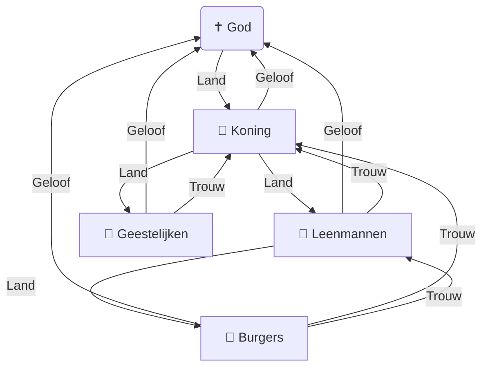

#### 1. Je weet hoe de **literatuurgeschiedenis** een aanvulling is op de algemene geschiedenis.
De literatuurgeschiedenis is een aanvulling op de algemene geschiedenis, doordat de algemene geschiedenis zich vooral richt op feiten, oorlogen en grote gebeurtenissen, terwijl de literatuurgeschiedenis laat zien wat de denkbeelden van mensen waren en hoe zij hun leven destijds vulden.
#### 2. Je kunt uitleggen dat men in verschillende tijden anders naar de geschiedenis keek. (perspectief)
In de Middeleeuwen keek men naar de geschiedenis vanuit een theocentrisch wereldbeeld. Het verloop van het leven en de geschiedenis werd gezien als een vast plan van God: je bestaan was slechts een tijdelijke voorbereiding waarin je een zo goed mogelijk christelijk leven moest leiden om in de hemel te komen.
#### 3. Je kunt het begrip 'idee' uitleggen.
Het idee is de algemene gedachtegang en het wereldbeeld van de mens.
#### 4. Je kunt uitleggen dat en waarom je de indeling in periodes niet heel nauwkeurig kunt maken. (afbakening)
De reden dat je de indeling van periodes in de geschiedenis niet goed kan indelen is doordat het een proces is en niet in één keer gaat: langzaamaan verandert de wereld naar een nieuw tijdperk. Verder verschilt de ontwikkeling ook per regio.
#### 5. Literair erfgoed.
Literair erfgoed is een lijst van de belangrijkste boeken van de (Nederlandse) literatuurgeschiedenis.
#### 6. Canon.
De canon is een lijst met belangrijke boeken in de huidige periode.
#### 7. Je kent de inhoud en de personages van [[Reinaert de Vos]].
Lees [[Reinaert de Vos]].
#### 8. Je weet wat een satire is.
Een satire is een kunstvorm waarbij vaak op humoristische wijze maatschappijkritiek of kritiek op personen wordt gegeven.
#### 9. Je weet welke drie groepen er belachelijk worden gemaakt in [[Reinaert de Vos]].
Lees [[Reinaert de Vos]].
#### 10. Je kent de auteur van [[Reinaert de Vos]]. En je weet dat het bijzonder is dat we die naam kennen.
De naam van de auteur van [[Reinaert de Vos]] is `Willem die Madocke maecte`. Het bijzondere aan dat wij de naam weten van de auteur is dat de meeste verhalen destijds anoniem waren.
#### 11. Je weet wat een hofdag is.
Een hofdag is een officiële bijeenkomst waarbij een koning of keizer zijn edelen, vazallen en belangrijke ridders bij elkaar riep om klachten van het volk te bespreken, beleid te voeren, en om te feesten, wat dacht je zelf.
#### 12. Memento mori.
Vertaald uit het Latijn betekent Memento mori `gedenk te sterven`, wat zegt dat je moet denken aan het feit dat je doodgaat en dus moet deugen als voorbereiding op het hiernamaals.
#### 13. Anoniem.
Men spreekt van [**anonimiteit**](https://nl.wikipedia.org/wiki/Anonimiteit) als de identiteit van een persoon niet bekend is of als hij die niet bekend wenst te maken.
#### 14. Plagiaat.
**[Plagiaat](https://nl.wikipedia.org/wiki/Plagiaat)** of **letterdieverij** is "het overnemen van stukken, gedachten, redeneringen van anderen en deze laten doorgaan voor eigen werk".
#### 15. Je weet dat middeleeuwse verhalen eerst decennialang mondeling (en vaak op rijm) werden overgeleverd. Je kunt uitleggen waarom dat zo was.
Middeleeuwse verhalen werden decennialang mondeling overgeleverd doordat er nog geen manier was om geschreven dingen te kopiëren; daardoor moest elke kopie van een boek met de hand gemaakt worden (en dat was duur zeg). Doordat het bijna niet mogelijk was om een verhaal te kopiëren of überhaupt vast te leggen, werden verhalen vooral met rijm mondeling gedeeld omdat rijm makkelijk te onthouden is.
#### 16. Je weet dat het geloof en het hiernamaals heel belangrijk waren in de middeleeuwen.
In de middeleeuwen stond het hele leven in het teken van God en het hiernamaals.
#### 17. Je kent de verschillen tussen de geestelijke en de wereldlijke macht.
De geestelijke macht lag in handen van de paus en de kerk voor zielenheil en geloof, terwijl de wereldlijke macht bij de koning lag voor bestuur, rechtspraak en orde.
#### 18. Je weet hoe men dacht over talent in de middeleeuwen.
Men dacht destijds dat al het talent aan jou was gegeven door God; dus als je ergens goed in was, was het niet van jou: het was van en door God, en als je niet deed waar je goed in was, zou je God teleurstellen.
#### 19. Monnikenwerk.
Monnikenwerk is lang eentonig werk zoals een boek overschrijven.
#### 20. Je kent de inhoud en de personages van [[Karel ende Elegast]].
Lees [[Karel ende Elegast]].
#### 21. Je weet het thema van [[Karel ende Elegast]].
Lees [[Karel ende Elegast]].
#### 22. Feodaal stelsel.

#### 23. Karelromans.
Een Karelroman is een voorhoofse middeleeuwse ridderroman, waarin de strijd, trouw aan de leenheer (Karel de Grote) en het christelijke geloof centraal staan, met ruwe omgangsvormen. Verder is dit een voorhoofse roman.
#### 24. Arthurromans.
Een Arthurroman is een hoofse middeleeuwse ridderroman, waarin de individuele zoektocht (queeste) van ridders van de Ronde Tafel en verfijnde omgangsvormen centraal staan. Verder is dit een hoofse roman. Lees [[Walewein]].
#### 25. Hoofs.
Een hoofse roman is een type middeleeuwse ridderroman waarin de ideale omgangsvormen en de 'hoofsheid' ([beleefdheid](https://nl.wikipedia.org/wiki/Beleefdheid)) van het ridderlijke hof centraal staan.
#### 26. Voorhoofs.
Een voorhoofse roman is een type middeleeuwse ridderroman waarin trouw aan de leenheer, brute kracht, strijd en trouw aan God centraal staan.

| Kenmerk | Karelroman (Voorhoofs) | Arthurroman (Hoofs) |
| :--- | :--- | :--- |
| **Periode** | Vroege / Hoge Middeleeuwen (~tot 1200) | Hoge & Late Middeleeuwen (~vanaf 1200) |
| **Centrale vorst** | **Karel de Grote** (historische koning/keizer) | **Koning Arthur** (mythische koning van de Ronde Tafel) |
| **Belangrijkste deugden** | Fysieke kracht, dapperheid, trouw aan leenheer | Zelfbeheersing, hoofsheid (beleefdheid), respect, trouw aan de dame |
| **Rol van de vrouw** | Ondergeschikt, passief, vaak ruw behandeld | Centraal, hooggeacht; inspiratie voor ridderlijke queeste (hoofse liefde) |
| **Sfeer & verhaallijn** | Harde oorlogen, veldslagen, feodale conflicten | Individuele zoektocht (queeste), avontuur, magie, mystiek (de Graal) |
| **Doel van de ridder** | Leenheer en God dienen, vijanden doden | Zichzelf bewijzen als beschaafd en deugdzaam ridder |
| **Typisch voorbeeld** | *[[Karel ende Elegast]]* | *[[Walewein]]*, *Ferguut*, *Lancelot* |

#### 27. Je kunt uitleggen dat de hoofse cultuur als het begin van de westerse beschaving wordt gezien.
De hoofse cultuur wordt gezien als het begin van de westerse beschaving omdat het de overgang markeerde van ruw, middeleeuws machtsvertoon naar verfijnde sociale omgangsvormen, zelfbeheersing en respect.
#### 28. Je weet de rol van de vrouw in de middeleeuwse literatuur.
De rol van de vrouw in de middeleeuwse literatuur was heel best groot. Vrouwen waren krachtige personages in verhalen, werkten als invloedrijke schrijvers en als opdrachtgevers.
#### 29. Je kunt deze rol uitleggen aan de hand van Beatrijs en Mariken van Nimwegen.
In beide verhalen hebben vrouwen de hoofdrol in een moreel verhaal (exempel) over zonde en vergeving:
- **[[Beatrijs]]:** Verlaat het klooster uit aardse liefde (zonde), maar wordt gered omdat ze trouw blijft bidden tot Maria. Lees [[Beatrijs]].
- **[[Mariken van Nimwegen]]:** Leeft jarenlang met de duivel, maar krijgt door diep berouw en zware boetedoening alsnog vergeving van God. Lees [[Mariken van Nimwegen]].
Ze laten zien dat de vrouw weliswaar vatbaar is voor verleiding (zoals Eva), maar door oprecht berouw en toewijding altijd gered kan worden (door Maria/God).
#### 30. Exempel.
Een exempel is een voorbeeld, maar een exempel is ook een kort, stichtelijk verhaal uit de middeleeuwen.
#### 31. Mariamirakel.
Een Mariamirakel is een middeleeuws verhaal of wonder waarbij de maagd Maria ingrijpt om een zondaar op een wonderbaarlijke manier te redden of te helpen.
#### 32. Mystiek.
Mystiek is een persoonlijke en directe ervaring of eenwording van de menselijke ziel met God.
#### 33. Hadewijch.
Hadewijch was een 13e-eeuwse [begijn](https://nl.wikipedia.org/wiki/Begijnen), dichteres en mystica die bekendstaat om haar werk over de mystieke liefde tussen mens en God.
#### 34. Heilige getallen.
- **1** staat voor de absolute eenheid en **God**.
- **2** symboliseert de strijd tussen **goed en kwaad** of dualiteit.
- **3** verwijst naar de **Heilige Drie-eenheid** en staat voor volmaaktheid.
- **4** vertegenwoordigt de **aarde** (de vier elementen en windstreken).
- **7** (3 + 4) verbindt God met de aarde en staat voor de **schepping en deugden**.
- **12** symboliseert **volledigheid**.
- **40** is het getal van **beproving en zuivering**.
#### 35. Minstrelen/troubadours.
- **Troubadours** waren vaak edellieden die zelf verfijnde liederen en gedichten componeerden, meestal over de hoofse liefde.
- **Minstrelen** waren artiesten uit lagere klassen die vaak in vaste dienst waren om liederen van anderen uit te voeren, nieuws te verspreiden en te entertainen.
#### 36. Je weet dat veel verhalen op rijm zijn geschreven en kunt uitleggen waarom.
Omdat rijm makkelijker is om te onthouden (zie 15).
#### 37. Rederijkerskamer.
Een rederijkerskamer is een laatmiddeleeuws burgerlijk genootschap waarin men zich bezighield met welsprekendheid, dichtkunst en toneel.
#### 38. Allegorie.
Een **allegorie** is een verhaal of gedicht waarin een abstract begrip of idee in zijn geheel wordt voorgesteld als een zichtbaar symbool of persoon.
#### 39. Je kunt uitleggen dat Elckerlyc een allegorie is en je weet welke vrienden hij vraagt om mee te gaan naar de dood.
Lees [[Elckerlyc]].
**[[Elckerlyc]]** ('iedereen') krijgt van de Dood te horen dat hij voor God moet verschijnen.
- **Gezelschap** (vrienden) en **Maagschap** (familie) haken direct af.
- **Bezit** (rijkdom) weigert en lacht hem uit.
- **Schoonheid, Kracht, Wijsheid** en **Zintuigen** verlaten hem bij de rand van het graf.
Alleen zijn **Deugd** (goede daden) gaat met hem mee het graf in, nadat **Kennisse** (inzicht) hem naar de biecht heeft geleid. De moraal: alleen je goede daden tellen na de dood.
#### 40. Je weet waarom de middeleeuwen zo zijn genoemd.
De middeleeuwen heten zo omdat deze periode precies in het **midden** ligt tussen twee andere grote tijdperken: de [Klassieke Oudheid](https://nl.wikipedia.org/wiki/Middeleeuwen) en de [Renaissance](https://nds-nl.wikipedia.org/wiki/Renaissance).
#### 41. Je weet tussen welke twee periodes de middeleeuwen liggen.
Lees [[#40. Je weet waarom de middeleeuwen zo zijn genoemd.]]
#### 42. Je kunt uitleggen waarom de uitvinding van de boekdrukkunst heel belangrijk is geweest.
De uitvinding van de boekdrukkunst door Johannes Gutenberg rond 1450 was belangrijk omdat boeken (en daardoor ook informatieoverdracht) voortaan snel, goedkoop en in grote aantallen konden worden gemaakt.
#### 43. Je weet dat de uitvinding van de boekdrukkunst aan het einde van de middeleeuwen was.
De middeleeuwen waren van 500 tot 1500 na Christus; de boekdrukkunst was uitgevonden rond 1450, dat is dus rond het einde.
#### 44. Je kent het Egidiuslied (blz. 185) van het handboek.
Lees [[Egidiuslied]].
#### 45. Je kunt uitleggen hoe het begrip 'memento mori' in dit gedicht naar voren komt.
In het [[Egidiuslied]] komt **memento mori** naar voren doordat de dood van een vriend de dichter herinnert aan zijn eigen sterfelijkheid, het tijdelijke aardse lijden en de absolute onvermijdelijkheid dat elk mens ooit moet sterven.